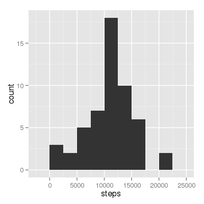

# Reproducible Research: Peer Assessment 1

This is an analysis of the activity data of a single person over a number of days.

## Loading and preprocessing the data

The data is contained in a zip file, so we unpack it using `zcat`
and read it.

```r
zippeddata <- "activity.zip"
dataset <- read.table(pipe(paste("zcat", zippeddata)), sep = ",", header = TRUE, 
    colClasses = c("numeric", "Date", "factor"))
```


We split the dataset into two separate sets:

1. one that has no missing values for `steps`,
2. one that has missing values for `steps`.  


```r
dataset_noNA <- dataset[!is.na(dataset$steps), ]
dataset_NA <- dataset[is.na(dataset$steps), ]
```


This makes it easier to deal with the missing values.


## What is the mean total number of steps taken per day?

We compute the total number of steps taken each day.

```r
steps_per_day <- aggregate(steps ~ date, data = dataset_noNA, sum)
```


And make a histogram of this.

```r
require(ggplot2)
```

```
## Loading required package: ggplot2
```

```r
ggplot(steps_per_day, aes(x = steps)) + geom_histogram(binwidth = 2500)
```

 


We also compute the mean and median.


```r
mean_steps <- mean(steps_per_day$steps)
median_steps <- median(steps_per_day$steps)
```


The mean number of steps is 1.0766 &times; 10<sup>4</sup>.

The median number of steps is 1.0765 &times; 10<sup>4</sup>.


## What is the average daily activity pattern?

We compute the mean number of steps per interval.


```r
mean_steps_by_interval <- aggregate(steps ~ interval, dataset_noNA, mean)
```


The interval is actually a encoded version of the time of day of the interval.
So interval 1200 starts is at 12:00. We use this to create some timestamps, these
will make it easier to plot and understand the data.


```r
mean_steps_by_interval$time_of_day <- strptime(sprintf("%04d", as.numeric(as.character(mean_steps_by_interval$interval))), 
    "%H%M")
```


We plot the mean number of steps as function of the interval.

```r
require(ggplot2)
require(scales)
```

```
## Loading required package: scales
```

```r

ggplot(mean_steps_by_interval, aes(x = time_of_day, y = steps)) + geom_point() + 
    scale_x_datetime(labels = date_format("%H:%M")) + xlab("interval") + ylab("average number of steps")
```

 


This person seems to be getting up around 06:00 in the morning and is winding
down around 19:00 in the evening.

We find the interval that, on average, has the highest number of steps.

```r
step_sorted <- sort(mean_steps_by_interval$steps, index.return = TRUE, decreasing = TRUE)
interval <- mean_steps_by_interval[step_sorted$ix[1], "interval"]
```


This is the interval 835.
Looks like this person is the most active around "08:35".  
Maybe walking to work?


## Imputing missing values


```r
number_of_missing_values <- nrow(dataset_NA)
```


There are 2304 missing values for `steps`.

We replace these missing values with the mean number of steps
of the corresponding interval.

We do this by using `interval` as an index into the previously
computed `mean_steps_by_interval`.

```r
dataset_NA$steps <- mean_steps_by_interval[dataset_NA$interval, "steps"]
```


We combine the two datasets back into a single dataset to get the original
dataset, but now with the missing values filled in.

```r
dataset <- rbind(dataset_NA, dataset_noNA)
```


We recompute the statistics to see the effect of the imputed missing values.


```r
steps_per_day_imp <- aggregate(steps ~ date, data = dataset, sum)
```


We compute these statistics with the previous ones in a singple
data frame so we can plot them side by side.

```r
steps_per_day_imp$imputed <- TRUE
steps_per_day$imputed <- FALSE
steps_per_day <- rbind(steps_per_day, steps_per_day_imp)
```


We plot both the histogram of the data with and without the imputed missing values.

```r
require(ggplot2)
ggplot(steps_per_day, aes(x = steps, fill = imputed)) + geom_histogram(binwidth = 2500, 
    position = "dodge")
```

 

Looks like it only had on effect on the center.

What is the effect on the median and mean.

```r
mean_steps_imp <- mean(steps_per_day$steps)
median_steps_imp <- median(steps_per_day$steps)
```


The mean number of steps is 1.0766 &times; 10<sup>4</sup> this was 1.0766 &times; 10<sup>4</sup>.

The median number of steps is 1.0766 &times; 10<sup>4</sup> this was 1.0765 &times; 10<sup>4</sup>.

Looks like the median shifted a tiny bit.


## Are there differences in activity patterns between weekdays and weekends?

We compute the average number steps grouped per interval and weekend/week day.

```r
dataset$weekend <- factor(weekdays(dataset$date) %in% c("Saturday", "Sunday"))
levels(dataset$weekend) <- c("weekday", "weekend")
mean_steps_by_interval <- aggregate(steps ~ interval + weekend, dataset, mean)
```


We make a panel plot showing the weekend / weekday division.

```r

mean_steps_by_interval$time_of_day <- strptime(sprintf("%04d", as.numeric(as.character(mean_steps_by_interval$interval))), 
    "%H%M")

ggplot(mean_steps_by_interval, aes(x = time_of_day, y = steps)) + geom_point() + 
    scale_x_datetime(labels = date_format("%H:%M")) + xlab("interval") + ylab("average number of steps") + 
    facet_grid(weekend ~ .)
```

 


From this plot it looks like this person gets up later in the morning
in the weekend. She or he is also longer active in the evening.
She or he also has a spike around 8:30 in the weekend, so it is likely
she is not walking to work at that time, but doing some exercise.


## Version Info


```r
sessionInfo()
```

```
## R version 3.1.0 (2014-04-10)
## Platform: x86_64-unknown-linux-gnu (64-bit)
## 
## locale:
##  [1] LC_CTYPE=en_US.UTF-8       LC_NUMERIC=C              
##  [3] LC_TIME=en_US.UTF-8        LC_COLLATE=en_US.UTF-8    
##  [5] LC_MONETARY=en_US.UTF-8    LC_MESSAGES=en_US.UTF-8   
##  [7] LC_PAPER=en_US.UTF-8       LC_NAME=C                 
##  [9] LC_ADDRESS=C               LC_TELEPHONE=C            
## [11] LC_MEASUREMENT=en_US.UTF-8 LC_IDENTIFICATION=C       
## 
## attached base packages:
## [1] stats     graphics  grDevices utils     datasets  methods   base     
## 
## other attached packages:
## [1] scales_0.2.4    ggplot2_0.9.3.1 knitr_1.5      
## 
## loaded via a namespace (and not attached):
##  [1] colorspace_1.2-4 digest_0.6.4     evaluate_0.5.5   formatR_0.10    
##  [5] grid_3.1.0       gtable_0.1.2     labeling_0.2     MASS_7.3-31     
##  [9] munsell_0.4.2    plyr_1.8.1       proto_0.3-10     Rcpp_0.11.1     
## [13] reshape2_1.4     stringr_0.6.2    tools_3.1.0
```


vi: spell spl=en ft=markdown
